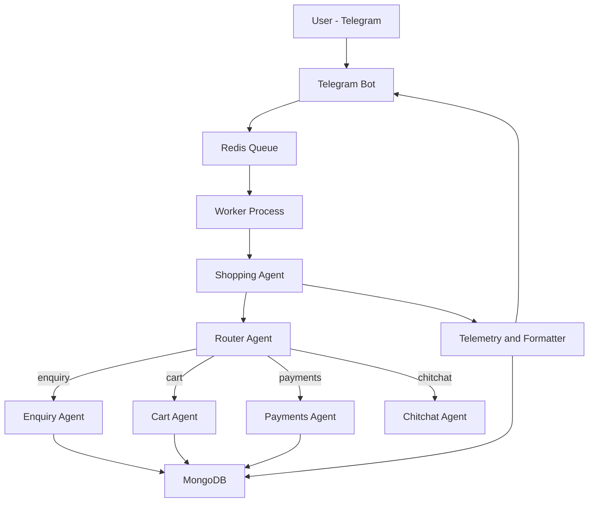

# ChatPay – Agentic Commerce Backend

ChatPay is an **agentic commerce backend** that turns chat interfaces (starting with **Telegram**) into fully interactive storefronts.  
Users can ask questions about products, manage carts, and eventually complete payments — all through natural language.

The system is **LLM-native**, event-driven, and designed to scale across multiple workers and businesses.


---

## Architecture Overview

ChatPay is built around **five cooperating agents**, orchestrated through a central `shopping_agent` using LangGraph.

### The 5 Agents

1. **Router Agent**  
   Routes user intent (`enquiry`, `cart_add`, `cart_view`, `payments`, `chitchat`)

2. **Enquiry Agent**  
   RAG-powered product and business Q&A with confidence scoring

3. **Cart Agent**  
   Deterministic cart logic (add / remove / view / clear)  
   Supports conversational references like *“add that”*

4. **Payments Agent**  
   Checkout flow (currently stubbed / disabled)

5. **Telemetry & Formatting Agent**  
   - Token usage tracking  
   - Event logging (cart, enquiry, payment attempts)  
   - Telegram-specific formatting (text + images)

---

## High-Level System Diagram



---

## Message Flow (Telegram)

1. User sends a message on Telegram  
2. Telegram webhook pushes update into **Redis (`chatpay_queue`)**  
3. One of many **workers** consumes the message  
4. Worker calls `chat_turn()` in `shopping_agent`  
5. Router selects the correct agent  
6. Agent produces a structured JSON envelope  
7. Formatter converts it to Telegram-friendly messages  
8. Worker sends response back to Telegram  

---

## Conversation & Identity Model

- **thread_id** → Telegram `user_id`  
- **turn_id** → UUID per user message  

This enables:
- Per-user conversation memory  
- Event correlation  
- Token usage attribution  

---

## Data & Storage

**MongoDB** is the system of record for:

- Conversations (per business, per thread)
- Carts
- Events (cart actions, enquiries, payments)
- Token usage (prompt / completion / total)
- RAG vectors & business knowledge

---

## Token Usage Tracking

All LLM calls go through `llm_wrapper.call_llm`, logging:

- `business_id`
- `thread_id`
- `turn_id`
- agent name
- model
- prompt / completion / total tokens

This enables:
- Cost attribution per conversation
- Per-business analytics
- Future billing & rate limits

---

## Environment Configuration

A `.env` file **is required**.

Example:

```env
OPENAI_API_KEY=...
BUSINESS_ID=...
REDIS_HOST=localhost
REDIS_PORT=6379
TELEGRAM_BOT_TOKEN=...
TOP_K=6
```

---

## Running the System

### 1. Activate virtual environment

```bash
source venv/bin/activate
```

---

### 2. Start Redis

Local Redis:

```bash
redis-server
```

Or via Docker:

```bash
docker run -p 6379:6379 redis
```

---

### 3. Start one or more workers

Each worker consumes from the same Redis queue.

```bash
WORKER_ID=worker-1 python main.py
```

Run multiple workers (recommended):

```bash
WORKER_ID=worker-2 python main.py
WORKER_ID=worker-3 python main.py
```

---

### 4. Telegram Webhook → Redis

Your Telegram webhook handler (external to this repo) should push **raw Telegram updates** into Redis:

```bash
LPUSH chatpay_queue '<telegram_update_json>'
```

Workers will automatically pick these up.

---

### 5. Local CLI Testing (Optional)

Run the backend without Telegram:

```bash
python cli_chat.py
```

---

## Shutdown

Graceful shutdown with:

```bash
Ctrl + C
```

Mongo connections are closed via `close_mongo()`.

---

## Current Status

- ✅ Telegram integration  
- ✅ Multi-worker architecture  
- ✅ RAG-powered enquiries  
- ✅ Conversational cart management  
- ✅ Token + event telemetry  
- 🚧 Payments (stubbed)  
- 🚧 Additional channels (WhatsApp planned)  

---

## Design Goals

- LLM-native from day one  
- Strong separation of intent via agents  
- Deterministic cart & payment logic  
- Fully observable (events + tokens)  
- Built for real merchants, not demos  

---

## Roadmap

- Enable payments (USDC + fiat)
- Per-business token budgets
- WhatsApp support
- Web chat widget
- Admin analytics dashboard